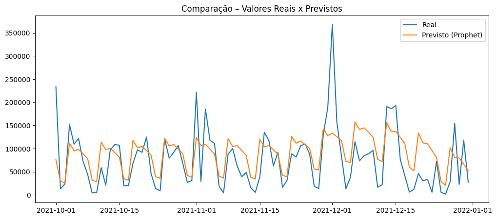

# 📊 Análise e Previsão de Gastos da CEAPS
Este projeto tem como objetivo analisar e prever os gastos da Cota para Exercício da Atividade Parlamentar (CEAPS), utilizando dados públicos do Senado Federal no período de 2018 a 2021.

## 🎯 Objetivo
Entender o comportamento histórico dos gastos dos senadores e aplicar técnicas de Forecasting para estimar valores futuros, começando por modelos simples e evoluindo para abordagens mais robustas.

## 📁 Dados
O dataset utilizado contém:
- `DS`: data do reembolso
- `Y`: soma dos reembolsos realizados no dia

Os dados foram previamente consolidados para facilitar a análise de séries temporais.

## 🧠 Metodologia
- Análise exploratória da série temporal
- Criação de um baseline com média móvel
- Separação de dados em treino e teste
- Modelagem com Facebook Prophet
- Avaliação do modelo com RMSE e MAPE

## 🛠 Tecnologias
- Python
- pandas
- Prophet
- Matplotlib
- Jupyter Notebook

## 📊 Resultados
O modelo conseguiu capturar bem a tendência e os padrões sazonais da série temporal, apesar da alta volatilidade diária dos dados. A análise demonstra a importância de modelos simples como baseline e o uso de técnicas adequadas para séries temporais financeiras.

## 📈 Comparação entre o real X previsto

## 🚀 Conclusão
Este projeto demonstra como dados públicos podem ser utilizados para gerar insights relevantes e apoiar análises de planejamento e transparência, reforçando a importância do Data Storytelling na comunicação dos resultados.
